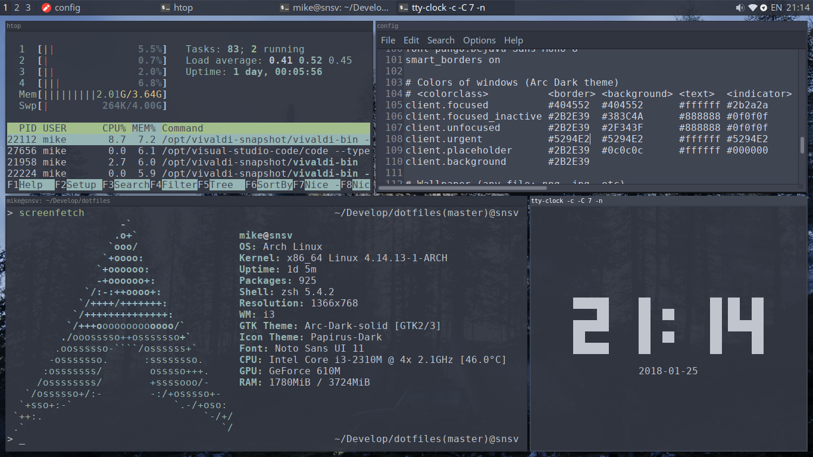
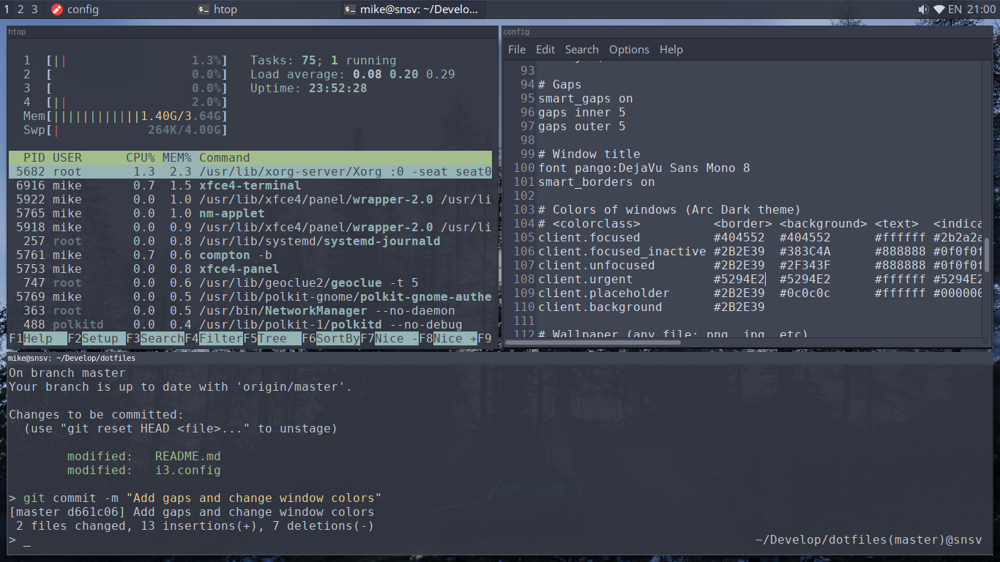

# dotfiles

[Download wallpaper](https://unsplash.com/photos/s95DnBWUe-8)

What included:

- Visual Studio Code
- i3-gaps + dmenu + keyboard layout (ru/en)
- dunst
- xfce4-terminal
- Telegram white notification icons

## How to install

Run `install.sh` script
