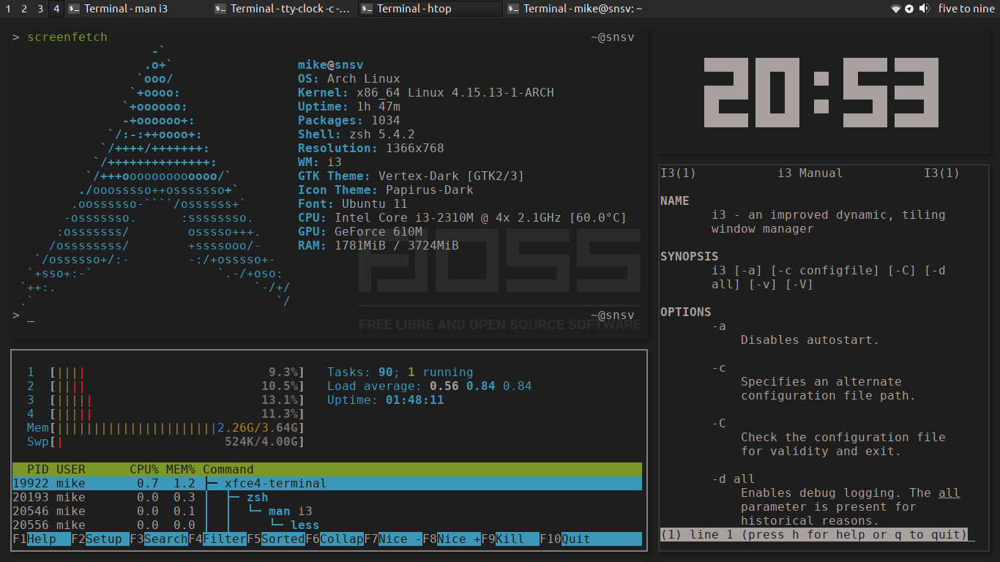

# dotfiles

[Download wallpaper](https://linux.pictures/projects/like-a-boss-free-libre-and-open-source-pic)

What included:

- i3-gaps + dmenu + keyboard layout (ru/en) + hotkeys
- dunst
- xfce4-terminal
- Telegram white notification icons
- Visual Studio Code

## How to install

Run `install.sh` script
